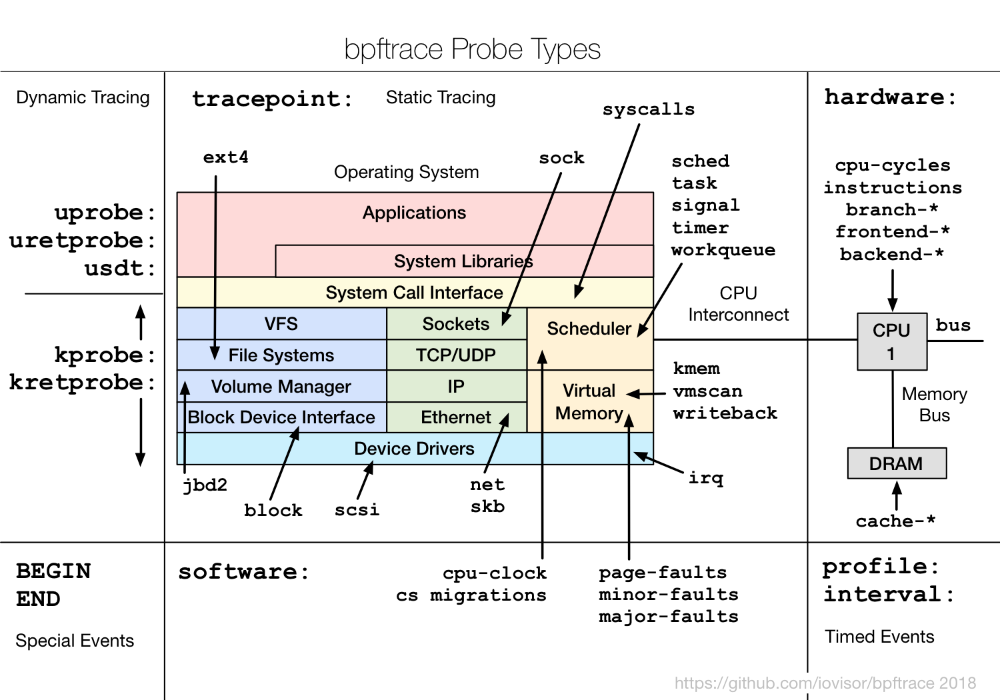
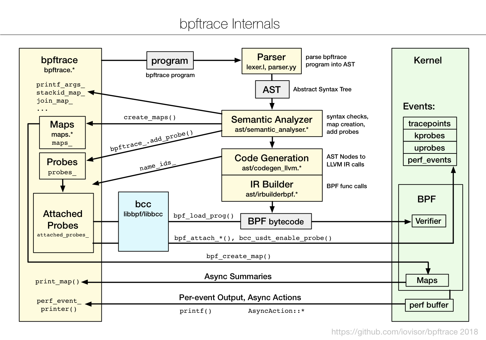

# BPFtrace

BPFtrace is a high-level tracing language for Linux enhanced Berkeley Packet Filter (eBPF) available in recent Linux kernels (4.x). BPFtrace uses LLVM as a backend to compile scripts to BPF-bytecode and makes use of [BCC](https://github.com/iovisor/bcc) for interacting with the Linux BPF system, as well as existing Linux tracing capabilities: kernel dynamic tracing (kprobes), user-level dynamic tracing (uprobes), and tracepoints. The BPFtrace language is inspired by awk and C, and predecessor tracers such as DTrace and SystemTap. BPFtrace was created by [Alastair Robertson](https://github.com/ajor).

To learn more about BPFtrace, see the [Reference Guide](docs/reference_guide.md) and [One-Liner Tutorial](docs/tutorial_one_liners.md).

## Install

For build and install instructions, see [INSTALL.md](INSTALL.md).

## Examples

Count system calls using tracepoints:
```
# bpftrace -e 'tracepoint:syscalls:sys_enter_* { @[probe] = count(); }'
Attaching 320 probes...
^C

...
@[tracepoint:syscalls:sys_enter_access]: 3291
@[tracepoint:syscalls:sys_enter_close]: 3897
@[tracepoint:syscalls:sys_enter_newstat]: 4268
@[tracepoint:syscalls:sys_enter_open]: 4609
@[tracepoint:syscalls:sys_enter_mmap]: 4781
```

Produce a histogram of time (in nanoseconds) spent in the `read()` system call:
```
// read.bt file
tracepoint:syscalls:sys_enter_read
{
  @start[tid] = nsecs;
}

tracepoint:syscalls:sys_exit_read / @start[tid] /
{
  @times = hist(nsecs - @start[tid]);
  delete(@start[tid]);
}
```
```
# bpftrace read.bt
Attaching 2 probes...
^C

@times:
[256, 512)           326 |@                                                   |
[512, 1k)           7715 |@@@@@@@@@@@@@@@@@@@@@@@@@@                          |
[1k, 2k)           15306 |@@@@@@@@@@@@@@@@@@@@@@@@@@@@@@@@@@@@@@@@@@@@@@@@@@@@|
[2k, 4k)             609 |@@                                                  |
[4k, 8k)             611 |@@                                                  |
[8k, 16k)            438 |@                                                   |
[16k, 32k)            59 |                                                    |
[32k, 64k)            36 |                                                    |
[64k, 128k)            5 |                                                    |
```

Print process name and paths for file opens, using kprobes (kernel dynamic tracing) of do_sys_open():
```
# bpftrace -e 'kprobe:do_sys_open { printf("%s: %s\n", comm, str(arg1)) }'
Attaching 1 probe...
git: .git/objects/da
git: .git/objects/pack
git: /etc/localtime
systemd-journal: /var/log/journal/72d0774c88dc4943ae3d34ac356125dd
DNS Res~ver #15: /etc/hosts
^C
```

CPU profiling, sampling kernel stacks at 99 Hertz:
```
# bpftrace -e 'profile:hz:99 { @[stack] = count() }'
Attaching 1 probe...
^C

...
@[
queue_work_on+41
tty_flip_buffer_push+43
pty_write+83
n_tty_write+434
tty_write+444
__vfs_write+55
vfs_write+177
sys_write+85
entry_SYSCALL_64_fastpath+26
]: 97
@[
cpuidle_enter_state+299
cpuidle_enter+23
call_cpuidle+35
do_idle+394
cpu_startup_entry+113
rest_init+132
start_kernel+1083
x86_64_start_reservations+41
x86_64_start_kernel+323
verify_cpu+0
]: 150
```

## One-Liners

The following one-liners demonstrate different capabilities:

```
# Files opened by process
bpftrace -e 'tracepoint:syscalls:sys_enter_open { printf("%s %s\n", comm, str(args->filename)); }'

# Syscall count by program
bpftrace -e 'tracepoint:raw_syscalls:sys_enter { @[comm] = count(); }'

# Read bytes by process:
bpftrace -e 'tracepoint:syscalls:sys_exit_read /args->ret/ { @[comm] = sum(args->ret); }'

# Read size distribution by process:
bpftrace -e 'tracepoint:syscalls:sys_exit_read { @[comm] = hist(args->ret); }'

# Show per-second syscall rates:
bpftrace -e 'tracepoint:raw_syscalls:sys_enter { @ = count(); } interval:s:1 { print(@); clear(@); }'

# Trace disk size by process
bpftrace -e 'tracepoint:block:block_rq_issue { printf("%d %s %d\n", pid, comm, args->bytes); }'

# Count page faults by process
bpftrace -e 'software:faults:1 { @[comm] = count(); }'

# Count LLC cache misses by process name and PID (uses PMCs):
bpftrace -e 'hardware:cache-misses:1000000 { @[comm, pid] = count(); }'

# Profile user-level stacks at 99 Hertz, for PID 189:
bpftrace -e 'profile:hz:99 /pid == 189/ { @[ustack] = count(); }'

# Files opened, for processes in the root cgroup-v2
bpftrace -e 'tracepoint:syscalls:sys_enter_openat /cgroup == cgroupid("/sys/fs/cgroup/unified/mycg")/ { printf("%s\n", str(args->filename)); }'
```

## Tools

bpftrace contains various tools, which also serve as examples of programming in the bpftrace language.

- tools/[bashreadline.bt](tools/bashreadline.bt): Print entered bash commands system wide. [Examples](tools/bashreadline_example.txt).
- tools/[biolatency.bt](tools/biolatency.bt): Block I/O latency as a histogram. [Examples](tools/biolatency_example.txt).
- tools/[biosnoop.bt](tools/biosnoop.bt): Block I/O tracing tool, showing per I/O latency. [Examples](tools/biosnoop_example.txt).
- tools/[bitesize.bt](tools/bitesize.bt): Show disk I/O size as a histogram. [Examples](tools/bitesize_example.txt).
- tools/[capable.bt](tools/capable.bt): Trace security capability checks. [Examples](tools/capable_example.txt).
- tools/[cpuwalk.bt](tools/cpuwalk.bt): Sample which CPUs are executing processes. [Examples](tools/cpuwalk_example.txt).
- tools/[dcsnoop.bt](tools/dcsnoop.bt): Trace directory entry cache (dcache) lookups. [Examples](tools/dcsnoop_example.txt).
- tools/[execsnoop.bt](tools/execsnoop.bt): Trace new processes via exec() syscalls. [Examples](tools/execsnoop_example.txt).
- tools/[gethostlatency.bt](tools/gethostlatency.bt): Show latency for getaddrinfo/gethostbyname[2] calls. [Examples](tools/gethostlatency_example.txt).
- tools/[killsnoop.bt](tools/killsnoop.bt): Trace signals issued by the kill() syscall. [Examples](tools/killsnoop_example.txt).
- tools/[loads.bt](tools/loads.bt): Print load averages. [Examples](tools/loads_example.txt).
- tools/[mdflush.bt](tools/mdflush.bt): Trace md flush events. [Examples](tools/mdflush_example.txt).
- tools/[opensnoop.bt](tools/loads.bt): Trace open() syscalls showing filenames. [Examples](tools/opensnoop_example.txt).
- tools/[oomkill.bt](tools/oomkill.bt): Trace OOM killer. [Examples](tools/oomkill_example.txt).
- tools/[pidpersec.bt](tools/pidpersec.bt): Count new processes (via fork). [Examples](tools/pidpersec_example.txt).
- tools/[runqlat.bt](tools/runqlat.bt): CPU scheduler run queue latency as a histogram. [Examples](tools/runqlat_example.txt).
- tools/[runqlen.bt](tools/runqlen.bt): CPU scheduler run queue length as a histogram. [Examples](tools/runqlen_example.txt).
- tools/[statsnoop.bt](tools/statsnoop.bt): Trace stat() syscalls for general debugging. [Examples](tools/statsnoop_example.txt).
- tools/[syncsnoop.bt](tools/syncsnoop.bt): Trace sync() variety of syscalls. [Examples](tools/syncsnoop_example.txt).
- tools/[syscount.bt](tools/syscount.bt): Count system calls. [Examples](tools/syscount_example.txt).
- tools/[tcpaccept](tools/tcpaccept.bt): Trace TCP passive connections (accept()). [Examples](tools/tcpaccept_example.txt).
- tools/[tcpconnect](tools/tcpconnect.bt): Trace TCP active connections (connect()). [Examples](tools/tcpconnect_example.txt).
- tools/[tcpdrop](tools/tcpdrop.bt): Trace kernel-based TCP packet drops with details. [Examples](tools/tcpdrop_example.txt).
- tools/[tcpretrans](tools/tcpretrans.bt): Trace TCP retransmits. [Examples](tools/tcpretrans_example.txt).
- tools/[vfscount.bt](tools/vfscount.bt): Count VFS calls. [Examples](tools/vfscount_example.txt).
- tools/[vfsstat.bt](tools/vfsstat.bt): Count some VFS calls, with per-second summaries. [Examples](tools/vfsstat_example.txt).
- tools/[writeback.bt](tools/writeback.bt): Trace file system writeback events with details. [Examples](tools/writeback_example.txt).
- tools/[xfsdist.bt](tools/xfsdist.bt): Summarize XFS operation latency distribution as a histogram. [Examples](tools/xfsdist_example.txt).

For more eBPF observability tools, see [bcc tools](https://github.com/iovisor/bcc#tools).

## Probe types
<center><a href="images/bpftrace_probes_2018.png"></a></center>

### kprobes
Attach a BPFtrace script to a kernel function, to be executed when that function is called:

`kprobe:vfs_read { ... }`

### uprobes
Attach script to a userland function:

`uprobe:/bin/bash:readline { ... }`

### tracepoints
Attach script to a statically defined tracepoint in the kernel:

`tracepoint:sched:sched_switch { ... }`

Tracepoints are guaranteed to be stable between kernel versions, unlike kprobes.

### software
Attach script to kernel software events, executing once every provided count or use a default:

`software:faults:100`
`software:faults:`

### hardware
Attach script to hardware events (PMCs), executing once every provided count or use a default:

`hardware:cache-references:1000000`
`hardware:cache-references:`

### profile
Run the script on all CPUs at specified time intervals:

`profile:hz:99 { ... }`

`profile:s:1 { ... }`

`profile:ms:20 { ... }`

`profile:us:1500 { ... }`

### interval
Run the script once per interval, for printing interval output:

`interval:s:1 { ... }`

`interval:ms:20 { ... }`

### Multiple attachment points
A single probe can be attached to multiple events:

`kprobe:vfs_read,kprobe:vfs_write { ... }`

### Wildcards
Some probe types allow wildcards to be used when attaching a probe:

`kprobe:vfs_* { ... }`

### Predicates
Define conditions for which a probe should be executed:

`kprobe:sys_open / uid == 0 / { ... }`

## Builtins
The following variables and functions are available for use in bpftrace scripts:

Variables:
- `pid` - Process ID (kernel tgid)
- `tid` - Thread ID (kernel pid)
- `cgroup` - Cgroup ID of the current process
- `uid` - User ID
- `gid` - Group ID
- `nsecs` - Nanosecond timestamp
- `cpu` - Processor ID
- `comm` - Process name
- `stack` - Kernel stack trace
- `ustack` - User stack trace
- `arg0`, `arg1`, ... etc. - Arguments to the function being traced
- `retval` - Return value from function being traced
- `func` - Name of the function currently being traced
- `probe` - Full name of the probe
- `curtask` - Current task_struct as a u64.
- `rand` - Random number of type u32.

Functions:
- `hist(int n)` - Produce a log2 histogram of values of `n`
- `lhist(int n, int min, int max, int step)` - Produce a linear histogram of values of `n`
- `count()` - Count the number of times this function is called
- `sum(int n)` - Sum this value
- `min(int n)` - Record the minimum value seen
- `max(int n)` - Record the maximum value seen
- `avg(int n)` - Average this value
- `stats(int n)` - Return the count, average, and total for this value
- `delete(@x)` - Delete the map element passed in as an argument
- `str(char *s)` - Returns the string pointed to by `s`
- `printf(char *fmt, ...)` - Print formatted to stdout
- `print(@x[, int top [, int div]])` - Print a map, with optional top entry count and divisor
- `clear(@x)` - Delete all key/values from a map
- `sym(void *p)` - Resolve kernel address
- `usym(void *p)` - Resolve user space address
- `ntop(int af, int addr)` - Resolve ip address
- `kaddr(char *name)` - Resolve kernel symbol name
- `uaddr(char *name)` - Resolve user space symbol name
- `reg(char *name)` - Returns the value stored in the named register
- `join(char *arr[])` - Prints the string array
- `time(char *fmt)` - Print the current time
- `system(char *fmt)` - Execute shell command
- `exit()` - Quit bpftrace

See the [Reference Guide](docs/reference_guide.md) for more detail.

## Internals

<center><a href="images/bpftrace_internals_2018.png"></a></center>

bpftrace employs various techniques for efficiency, minimizing the instrumentation overhead. Summary statistics are stored in kernel BPF maps, which are asynchronously copied from kernel to user-space, only when needed. Other data, and asynchronous actions, are passed from kernel to user-space via the perf output buffer.
