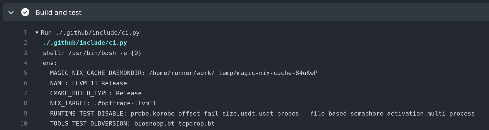

# bpftrace development guide

This document features basic guidelines and recommendations on how to do
bpftrace development. Please read it carefully before submitting pull requests
to simplify reviewing and to speed up the merge process.

## Building

The project supports the following recommended build workflows. Please choose
the one that works the best for you.

### Nix build

Nix is the most convenient way to build and test bpftrace. Nix will manage
all of bpftrace's build and runtime dependencies. It also has the advantage
of being used by the CI, so you are more likely to shake out errors before
submitting your change and seeing the CI fail.

The Nix build is documented in [nix.md](./nix.md).

### Distro build

The "distro build" is the more traditional way to build bpftrace. It relies on
you installing all of bpftrace's build and runtime dependencies on your host
and then calling into `cmake`.

Please be aware that bpftrace has strict dependencies on new versions of
`libbpf` and `bcc`. They are two of bpftrace's most important dependencies and
we plan on tracking their upstream quite closely over time.

As a result, while the distro build should work well on distros with newer
packages, developers on distros that lag more behind (for example Debian) may
want to consider using the Nix build. Or manually building and installing
`bcc` and `libbpf`.

The distro build is documented in [INSTALL.md](../INSTALL.md#generic-build-process).

### Vagrant build

We also provide tentative support for building and testing using Vagrant. The boxes
we define in our [`Vagrantfile`](../Vagrantfile) should contain all the necessary
dependencies to build and run bpftrace. Please be aware we do not have _too_ many
folks using the vagrant workflow, so it may be a little out of date.

This is useful if the host you're developing on does not run linux.

Make sure you have the `vbguest` plugin installed - it is required to correctly
install the shared file system driver on the ubuntu boxes:

```
$ vagrant plugin install vagrant-vbguest
```

Start VM:

```
$ vagrant status
$ vagrant up $YOUR_CHOICE
$ vagrant ssh $YOUR_CHOICE
```

## [Tests](../tests/README.md)

Every contribution should (1) not break the existing tests and (2) introduce new
tests if relevant. See existing tests for inspiration on how to write new ones. [Read more on the different kinds and how to run them](../tests/README.md).

## Continuous integration

CI executes the above tests in a matrix of different LLVM versions on NixOS.
The jobs are defined in `.github/workflows/ci.yml`.

### Running the CI

CI is automatically run on all branches and pull requests on the main repo. We
recommend to enable the CI (GitHub Actions) on your own fork, too, which will
allow you to run the CI against your testing branches.

### Debugging CI failures

It may often happen that tests pass on your local setup but fail in one of the
CI environments. In such a case, it is useful to reproduce the environment to
debug the issue.

To reproduce the NixOS jobs (from `.github/workflows/ci.yml`):

1. Acquire the job environment from the GHA UI: 
1. Run `.github/include/ci.py` with the relevant environment variables set

Example `ci.py` invocations:

```
$ NIX_TARGET=.#bpftrace-llvm10  ./.github/include/ci.py
```

```
$ NIX_TARGET=.#bpftrace-llvm11  \
  CMAKE_BUILD_TYPE=Release \
  RUNTIME_TEST_DISABLE="probe.kprobe_offset_fail_size,usdt.usdt probes - file based semaphore activation multi process" \
  ./.github/include/ci.py
```

### Known issues

Some tests are known to be flaky and sometimes fail in the CI environment. The
list of known such tests:
- runtime test `usdt.usdt probes - file based semaphore activation multi
  process` ([#2410](https://github.com/iovisor/bpftrace/issues/2402))

What usually helps, is restarting the CI. This is simple on your own fork but
requires one of the maintainers for pull requests.

## Code style

We use clang-format with our custom config for formatting code. This was
[introduced](https://github.com/iovisor/bpftrace/pull/639) after a lot of code
was already written. Instead of formatting the whole code base at once and
breaking `git blame` we're taking an incremental approach, each new/modified bit
of code needs to be formatted.
The CI checks this too, if the changes don't adhere to our style the job will fail.

### Using clang-format

[git clang-format](https://github.com/llvm/llvm-project/blob/main/clang/tools/clang-format/git-clang-format)
can be used to easily format commits, e.g. `git clang-format upstream/master`

### Avoid 'fix formatting' commits

We want to avoid `fix formatting` commits. Instead every commit should be
formatted correctly.

## Changelog

The changelog is for end users. It should provide them with a quick summary of
all changes important to them. Internal changes like refactoring or test changes
do not belong to it.

### Maintaining the changelog

To avoid having write a changelog when we do a release (which leads to useless
changelog or a lot of work) we write them as we go. That means that every PR
that has a user impacting change must also include a changelog entry.

As we include the PR number in the changelog format this can only be done after
the PR has been opened.

If it is a single commit PR we include the changelog in that commit, when the PR
consists of multiple commits it is OK to add a separate commit for the changelog.

## bpftrace internals

For more details on bpftrace internals, see
[internals_development.md](internals_development.md).
